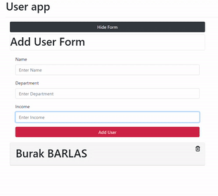

## Available Scripts

In the project directory, you can run:

### `npm start`

Runs the app in the development mode. 
Open [http://localhost:3000](http://localhost:3000) to view it in the browser.

Simple user form application which provides features such as adding new users with user information and deleting.

<!-- {:height="20px" width="36px"} -->
 